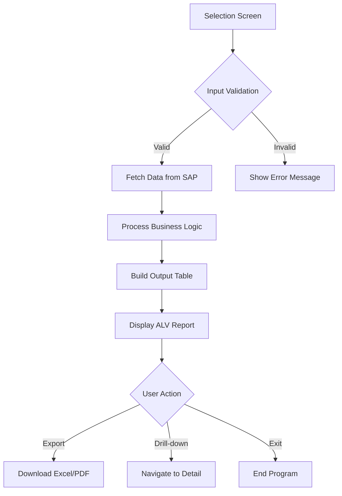
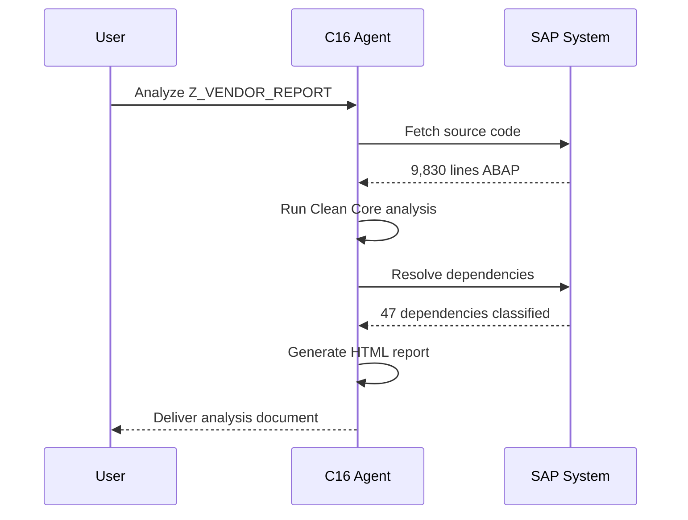
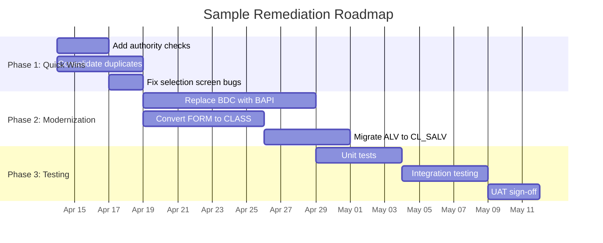
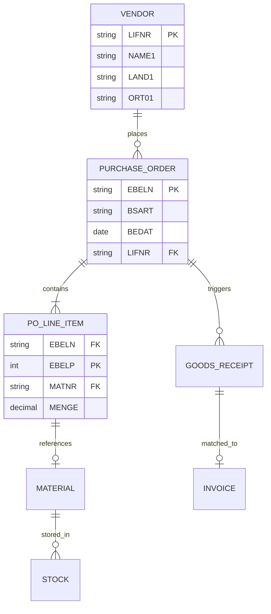

# C16 Platform — Sample Markdown Report

> **Generated:** 13 April 2026 | **Author:** C16 Intelligence Engine | **Version:** 1.0

---

## 1. Executive Summary

This document demonstrates **Markdown file generation** within the C16 platform. It showcases all supported formatting elements including headings, tables, code blocks, Mermaid diagrams, blockquotes, and nested lists.

**Key Highlights:**
- ✅ Native Markdown output (not HTML wrapped in `.md`)
- ✅ Mermaid diagram support for flowcharts, sequence diagrams, and Gantt charts
- ✅ ABAP code blocks with syntax hints
- ✅ Structured tables with alignment
- ✅ Nested lists, blockquotes, and badges

---

## 2. Formatting Showcase

### 2.1 Text Styles

| Style | Syntax | Result |
|-------|--------|--------|
| Bold | `**text**` | **bold text** |
| Italic | `*text*` | *italic text* |
| Code | `` `text` `` | `inline code` |
| Strikethrough | `~~text~~` | ~~strikethrough~~ |
| Bold + Italic | `***text***` | ***bold italic*** |

### 2.2 Blockquotes

> 💡 **Pro Tip:** C16 generates native Markdown when you request `.md` output — no HTML wrapping.

> ⚠️ **Warning:** Always verify SAP field names against the Data Dictionary before generating code.

> 🔴 **Critical:** Never deploy to production without a transport request and code review.

### 2.3 Nested Lists

1. **Phase 1 — Discovery**
   - Identify custom objects in SAP
   - Classify by module (MM, SD, FI, PP)
     - Sub-classify by object type (PROG, CLAS, FUGR)
     - Tag with Clean Core level (A, B, C, D)
   - Document business context

2. **Phase 2 — Analysis**
   - Run Clean Core compliance checks
   - Identify deprecated API usage
   - Map to standard SAP alternatives

3. **Phase 3 — Remediation**
   - Quick wins (consolidation, auth checks)
   - Medium effort (BAPI rewrites, OO refactoring)
   - Strategic (RAP migration, Fiori Elements)

---

## 3. Mermaid Diagrams

### 3.1 Architecture Flowchart



### 3.2 Sequence Diagram



### 3.3 Gantt Chart



### 3.4 Entity Relationship Diagram



---

## 4. ABAP Code Examples

### 4.1 Modern ABAP 7.40 Inline Declarations

```abap
" Inline DATA declarations
SELECT ebeln, bukrs, bsart, lifnr, bedat
  FROM ekko
  INTO TABLE @DATA(lt_orders)
  WHERE bukrs = @p_bukrs
    AND bedat IN @s_bedat.

" Table expression with inline field symbol
LOOP AT lt_orders ASSIGNING FIELD-SYMBOL(<fs_order>).
  " String template
  DATA(lv_message) = |PO { <fs_order>-ebeln } from vendor { <fs_order>-lifnr }|.
  WRITE: / lv_message.
ENDLOOP.
```

### 4.2 Constructor Expressions

```abap
" VALUE constructor
DATA(lt_status) = VALUE tt_status(
  ( key = 'A' text = 'Active' )
  ( key = 'I' text = 'Inactive' )
  ( key = 'B' text = 'Blocked' )
).

" COND expression
DATA(lv_color) = COND #(
  WHEN lv_amount > 100000 THEN 'RED'
  WHEN lv_amount > 50000  THEN 'YELLOW'
  ELSE 'GREEN'
).

" REDUCE for aggregation
DATA(lv_total) = REDUCE netwr_ap(
  INIT sum = CONV netwr_ap( 0 )
  FOR wa IN lt_orders
  NEXT sum = sum + wa-netwr
).
```

### 4.3 CL_SALV_TABLE Pattern

```abap
TRY.
    cl_salv_table=>factory(
      IMPORTING r_salv_table = DATA(lo_alv)
      CHANGING  t_table      = lt_output
    ).

    " Configure columns
    DATA(lo_columns) = lo_alv->get_columns( ).
    lo_columns->set_optimize( abap_true ).

    " Set column headers
    DATA(lo_col) = CAST cl_salv_column_table(
      lo_columns->get_column( 'EBELN' )
    ).
    lo_col->set_long_text( 'Purchase Order' ).

    " Display
    lo_alv->display( ).

  CATCH cx_salv_msg cx_salv_not_found INTO DATA(lx_err).
    MESSAGE lx_err->get_text( ) TYPE 'E'.
ENDTRY.
```

---

## 5. Clean Core Classification Reference

| Level | Name | Description | Examples |
|:-----:|------|-------------|----------|
| **A** | Cloud-Ready | Uses only released APIs | CDS views, RAP BOs, released BAPIs |
| **B** | Classic | Stable but not cloud-released | REUSE_ALV, classic BAPIs, SLIS |
| **C** | Non-Compliant | Direct DB access, unreleased APIs | `SELECT FROM ekko`, internal FMs |
| **D** | Critical | Deprecated or unsupported patterns | SAPscript, modifications, USER_EXIT |

### Decision Matrix

| Current State | Target | Action | Effort |
|--------------|--------|--------|--------|
| Level D → A | Full rewrite | RAP + Fiori Elements | High |
| Level C → B | API migration | Replace SELECT with BAPI/CDS | Medium |
| Level C → A | Full modernization | CDS + RAP + released APIs | High |
| Level B → A | Cloud enablement | Replace classic APIs with released | Low-Medium |
| Level A | Maintain | Already compliant | None |

---

## 6. Sample Metrics Dashboard

### KPI Summary

| Metric | Value | Status |
|--------|------:|:------:|
| Total Custom Programs | 1,282 | ℹ️ |
| Clean Core Level A | 127 (10%) | ✅ |
| Clean Core Level B | 384 (30%) | 🟡 |
| Clean Core Level C | 612 (48%) | 🟠 |
| Clean Core Level D | 159 (12%) | 🔴 |
| Programs > 1,000 lines | 243 | ⚠️ |
| Programs with no auth checks | 89 | 🔴 |
| Avg. code duplication | 34% | 🟠 |

---

## 7. Horizontal Rules & Separators

Use `---` for thematic breaks between major sections:

---

## 8. Links & References

- [SAP Clean Core Guidelines](https://help.sap.com/docs/clean-core)
- [ABAP 7.40 Quick Reference](https://help.sap.com/doc/abapdocu_740_index_htm/7.40/en-US/index.htm)
- [SAP API Business Hub](https://api.sap.com)
- [Fiori Design Guidelines](https://experience.sap.com/fiori-design/)

---

## 9. Checklist Example

- [x] Source code fetched from SAP
- [x] Pre-computed metrics extracted
- [x] Clean Core classification completed
- [x] Dependency tree resolved
- [ ] Remediation code generated
- [ ] Unit tests written
- [ ] Deployed to SAP
- [ ] UAT sign-off received

---

## 10. Summary

This document demonstrated the full range of Markdown capabilities available in C16:

| Feature | Demonstrated |
|---------|:------------:|
| Headings (H1–H3) | ✅ |
| Bold, italic, code | ✅ |
| Tables with alignment | ✅ |
| Ordered & nested lists | ✅ |
| Blockquotes with emoji | ✅ |
| ABAP code blocks | ✅ |
| Mermaid flowcharts | ✅ |
| Mermaid sequence diagrams | ✅ |
| Mermaid Gantt charts | ✅ |
| Mermaid ER diagrams | ✅ |
| Checklists | ✅ |
| Horizontal rules | ✅ |
| Links | ✅ |

---

*Generated by C16 Intelligence Engine — 13 April 2026*
