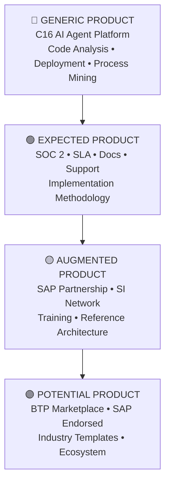
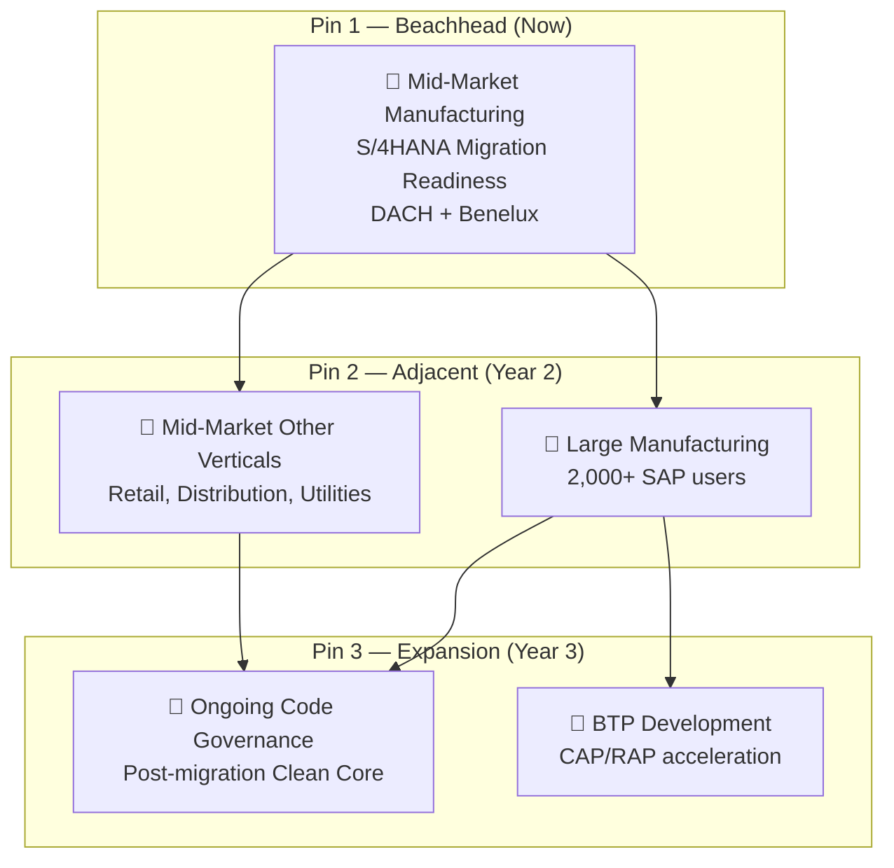
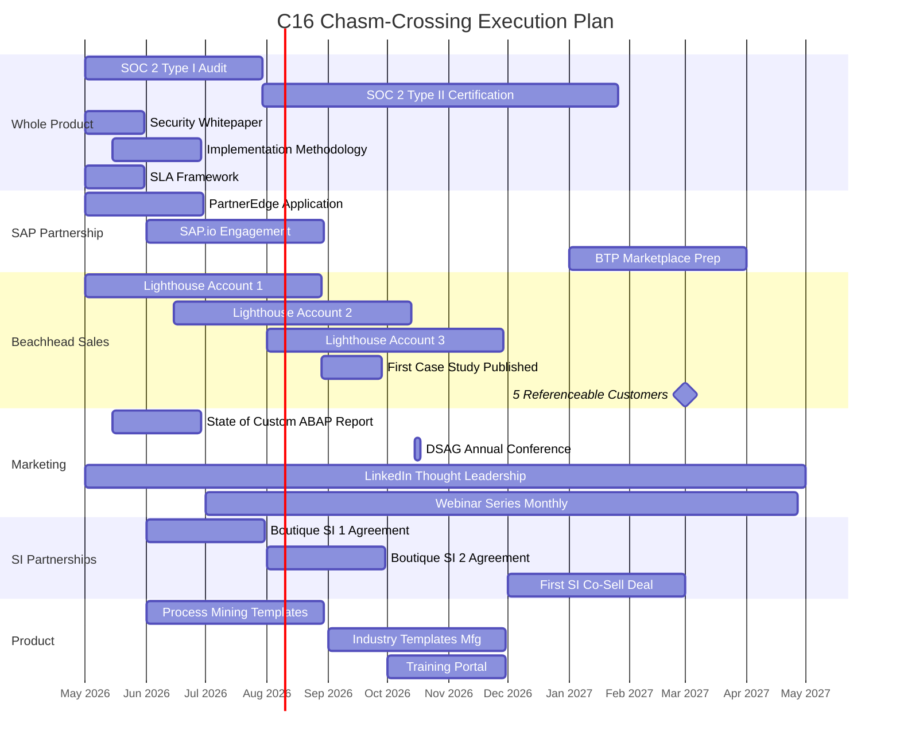

# C16 Go-to-Market Sales Strategy
## Crossing the Chasm — From Early Adopters to Enterprise Mainstream

**Integrating Geoffrey Moore's Technology Adoption Lifecycle with Challenger Sale Methodology**

---

| Attribute | Detail |
|-----------|--------|
| **Document** | GTM Strategy Playbook v2.0 |
| **Product** | C16 — AI Agent for SAP |
| **Frameworks** | *Crossing the Chasm* (Moore) · *The Challenger Sale* (Dixon & Adamson) |
| **Audience** | Founders, Sales, Marketing, Investors |
| **Date** | April 2026 |
| **Classification** | Confidential — Internal |

---

## Table of Contents

1. [Strategic Thesis — Why the Chasm Matters for C16](#1-strategic-thesis)
2. [Technology Adoption Lifecycle Applied](#2-technology-adoption-lifecycle)
3. [Where C16 Sits Today — Edge of the Chasm](#3-current-position)
4. [Beachhead Segment — The D-Day Strategy](#4-beachhead-segment)
5. [The Whole Product — Closing the Gap](#5-the-whole-product)
6. [Challenger Sale Integration — Teaching, Not Selling](#6-challenger-sale-integration)
7. [Buyer Personas & the Decision-Making Unit](#7-buyer-personas)
8. [Positioning & Messaging Architecture](#8-positioning)
9. [The Sales Playbook — Conversation to Close](#9-the-sales-playbook)
10. [Bowling Pin Strategy — Segment Sequencing](#10-bowling-pin-strategy)
11. [Competitive Landscape & Moat Analysis](#11-competitive-landscape)
12. [KPIs, Milestones & the Tornado Watch](#12-kpis-and-milestones)
13. [18-Month Execution Roadmap](#13-execution-roadmap)
14. [Chasm Risks & Mitigation Playbook](#14-risks)
15. [The One-Page Playbook — Summary for the Sales Floor](#15-one-page-playbook)

---

## 1. Strategic Thesis

> *"The chasm exists because after the visionaries have bought in, there is a period of no market — a gap between the early market and the mainstream market where products go to die."*
> — Geoffrey Moore, *Crossing the Chasm*

C16 is not an incremental feature added to an existing SAP tool. It is a **new product category** — an autonomous AI agent that reads, writes, analyses, deploys, and governs SAP code and business processes in real time. This positioning matters enormously because it determines the shape of our go-to-market challenge.

When a product creates a new category, the Technology Adoption Lifecycle (TALC) becomes the single most important strategic framework. Every technology startup that creates genuine discontinuity faces the same lethal gap: the **chasm** between visionary early adopters who buy on potential, and pragmatist early majority buyers who buy on proven results, references, and whole product completeness.

### ⚠️ The Core Danger

Most enterprise technology startups die in the chasm — not because their product is bad, but because they fail to concentrate force on a single beachhead, try to sell to everyone, and spread their reference base so thin that no single segment sees them as the dominant solution. C16 must avoid this fate with surgical precision.

### Three Compounding Challenges Specific to C16

C16 faces the classic chasm problem amplified by three factors unique to the SAP ecosystem:

| Challenge | Why It's Hard | Moore's Answer | C16's Application |
|-----------|---------------|----------------|-------------------|
| **1. Conservative Buyers** | SAP customers are among the most risk-averse enterprise buyers in technology. Their systems run payroll, supply chains, and financial close. Downtime = board-level visibility. | Pragmatists buy from market leaders within their segment. You must *become* the market leader in a narrow segment first. | Own the "Clean Core readiness for S/4HANA migration" niche completely before expanding. |
| **2. Complex Decision-Making Units** | SAP buying decisions involve 6-12 stakeholders: CIO, VP Apps, Basis, Developers, Procurement, Security, Compliance. Any one can veto. | Address the whole product — not just the core technology, but everything the buyer needs to feel confident saying yes. | Build the whole product: SOC 2 compliance, SAP-endorsed partnership, reference architectures, professional services wrapper. |
| **3. AI Trust Deficit** | Enterprise buyers are skeptical of AI claims. They've seen "AI-powered" tools that are glorified chatbots. An AI agent that *writes and deploys code to production SAP* triggers deep fear. | Reduce perceived risk through social proof within the segment. One customer's testimony is worth 100 demos. | Produce 3-5 *referenceable* success stories with measurable ROI within the beachhead before expanding. |

### The Strategic Thesis in One Sentence

> **🎯 Win the "S/4HANA Clean Core migration readiness" beachhead in mid-market manufacturing (200-2,000 SAP users) by delivering a *whole product* that makes the CIO's migration decision defensible, and use Challenger Sale methodology to teach buyers the hidden cost of their current custom code — a cost they cannot see without C16.**

---

## 2. Technology Adoption Lifecycle

Moore's Technology Adoption Lifecycle describes five buyer psychographics. Each group has fundamentally different motivations, risk tolerances, and buying criteria. The critical insight is that **the transition between early adopters and the early majority is not a smooth continuum — it is a yawning chasm** that destroys companies who don't recognise it.

### The Five Segments

```
┌──────────────┬──────────────┬────────┬──────────────┬──────────────┐
│  INNOVATORS  │    EARLY     │  THE   │    EARLY     │     LATE     │
│    2.5%      │  ADOPTERS    │ CHASM  │  MAJORITY    │  MAJORITY    │
│              │   13.5%      │   ⚡   │    34%       │    34%       │
│ Tech lovers  │ Visionaries  │        │ Pragmatists  │ Conservatives│
│ Buy to       │ Buy for      │ Where  │ Buy proven   │ Buy when     │
│ explore      │ advantage    │ startups│ solutions    │ it's standard│
│              │              │ die    │              │              │
└──────────────┴──────────────┴────────┴──────────────┴──────────────┘
```

### How Each Group Buys — and What C16 Means to Them

| Segment | Who They Are for C16 | What They Want | How They Buy | C16's Status |
|---------|---------------------|----------------|--------------|-------------|
| **Innovators** | ABAP developers and SAP architects who follow AI trends. Individual contributors on SAP Community. Hackathon participants. | Access to the technology. Ability to experiment. Bragging rights. | Self-serve. Free tier. No procurement. No committee. | ✅ Captured |
| **Early Adopters** | VP of IT / CIO at firms facing S/4HANA migration deadline (2027-2030). They see AI as a way to compress a 2-year migration into 6 months. | Strategic leverage. Speed. A way to leapfrog competitors. Willing to co-create with vendor. | Visionary champion sells internally. Tolerates incomplete product if vision is compelling. | 🔄 In Progress — 3-6 lighthouse accounts |
| **THE CHASM** | ← **We are here. The next 18 months determine everything.** → | | | ⚡ Current Position |
| **Early Majority** | IT Directors at mid-market manufacturing/distribution companies running ECC 6.0. Budget-conscious. Risk-averse. Need peer validation. | Proven solution. Reference customers in *their* industry. Complete product with services. Support SLAs. | Formal procurement. RFP/RFI. Committee decision. 3-6 month cycle. Needs security review, SOC 2, SAP partnership proof. | 🎯 Target — beachhead strategy needed |
| **Late Majority** | Large enterprises with existing SI relationships (Accenture, Deloitte, IBM). Only buy when "everyone else is using it." | Zero risk. Fully productised. SAP-endorsed. SI-delivered. | SI recommends as part of a larger deal. C16 must be in SI partner portfolios. | ⏳ Future — requires SI partnerships |

---

## 3. Current Position

| KPI | Value |
|-----|-------|
| **Current Lifecycle Stage** | Early Adopter — approaching the chasm |
| **Lighthouse Accounts Needed** | 3-6 referenceable before crossing |
| **Chasm-Crossing Window** | 18 months (Q2 2026 → Q4 2027) |
| **Target ACV for Beachhead** | $150K+ (justifies enterprise sales motion) |

### Evidence That We're at the Chasm Edge

Several observable signals confirm that C16 has successfully won innovator and early adopter attention, but has not yet made the leap to pragmatist adoption.

**✅ What We've Achieved (Early Market)**
- Product-market resonance with technical SAP audiences — demos generate genuine excitement
- The product works: 1,299+ programs analysed, real-time code deployment, live SAP connectivity
- Differentiated capability no competitor can replicate today (agentic SAP development)
- Founder-led sales pipeline with 10+ enterprise conversations
- Category creation — "AI Agent for SAP" is a term C16 is defining

**⚠️ What We're Missing (Chasm Gaps)**
- No **referenceable** customer with published ROI metrics
- No SOC 2 Type II certification (table stakes for enterprise procurement)
- No formal SAP partnership (PartnerEdge, certified integration)
- No documented implementation methodology with timeline guarantees
- No dedicated customer success / professional services capacity
- No pricing model validated by willingness-to-pay research

> 📖 **Moore's Warning:** *"The visionaries are the ones who give high-tech companies their first break. But the very qualities that make them great early customers — their willingness to take risks, their desire to be first, their tolerance for bugs and missing features — make them terrible references for the pragmatist buyer. Pragmatists don't want to hear about vision. They want to hear about implementation."*
>
> This means C16's early adopter wins — however impressive — will not automatically translate into mainstream sales. We need a fundamentally different approach for the next segment.

---

## 4. Beachhead Segment

> *"The key to crossing the chasm is to pick a single beachhead market segment and focus all your energy on dominating it. This is the D-Day strategy — choose Normandy, not 'Europe'."*
> — Geoffrey Moore

The single most important strategic decision C16 will make is **which segment to attack first**. This is not a marketing exercise — it is an existential choice. The right beachhead creates a defensible position from which every subsequent segment becomes easier. The wrong one leaves us stranded on a beach with no supply lines.

### Beachhead Selection Criteria (Moore's Framework)

Moore provides nine evaluation criteria for beachhead candidates:

| # | Criterion | What It Means | C16 Application |
|---|-----------|---------------|-----------------|
| 1 | **Target Customer** | Is there a single, identifiable economic buyer? | CIO / VP IT at mid-market companies with SAP ECC |
| 2 | **Compelling Reason to Buy** | Is there a burning platform — a problem they can't ignore? | SAP ECC end-of-life 2027 → mandatory S/4HANA migration |
| 3 | **Whole Product** | Can we deliver a complete solution (not just technology)? | Analysis + remediation + migration planning — yes with services |
| 4 | **Competition** | Is there an established competitor we'd have to unseat? | No direct competitor for agentic SAP analysis — green field |
| 5 | **Partners & Allies** | Can we assemble a complete ecosystem? | SAP-adjacent SIs, boutique migration firms — achievable |
| 6 | **Distribution** | Can we reach these buyers through existing channels? | DSAG/ASUG events, SAP Community, LinkedIn — yes |
| 7 | **Pricing** | Will they pay enough to sustain the business? | $100K-$300K ACV for migration readiness — validated by SI pricing |
| 8 | **Positioning** | Can we own this space in the customer's mind? | "The AI engine that makes S/4HANA migration safe" — clear, ownable |
| 9 | **Next Target** | Does winning here create adjacency to the next segment? | Yes → large enterprise migrations, ongoing code governance, BTP |

### 🏖️ The Beachhead: S/4HANA Migration Readiness for Mid-Market Manufacturing

**Segment:** Mid-market discrete manufacturing companies (€200M–€2B revenue) running SAP ECC 6.0 with 200-2,000 SAP users, facing mandatory S/4HANA migration before 2027-2030.

**Geography:** DACH (Germany, Austria, Switzerland) + Benelux + UK — highest density of SAP ECC installations per capita.

**Use Case:** Custom code assessment + Clean Core remediation + migration risk reduction — the first phase of any S/4HANA project.

**Why This Segment:**
- They have a **hard deadline** (ECC end-of-life) — the burning platform is real and immovable
- They lack internal capacity — typically 2-5 ABAP developers, overwhelmed by 500-3,000 custom objects
- They can't afford the Big 4 SI rates ($250-$400/hr × 12-24 months) but desperately need the analysis
- Decision-making units are smaller (3-5 people) — faster sales cycles than Fortune 500
- Manufacturing is the largest SAP vertical — winning here creates massive adjacency

### Segment Sizing

| Metric | DACH | Benelux + UK | Total Addressable |
|--------|------|-------------|-------------------|
| Companies running ECC 6.0 in manufacturing (mid-market) | ~4,500 | ~2,800 | ~7,300 |
| Facing migration by 2030 | ~4,200 | ~2,500 | ~6,700 |
| With 500+ custom Z-objects (C16's sweet spot) | ~2,800 | ~1,600 | ~4,400 |
| ACV at $150K | → | → | **$660M TAM for beachhead alone** |
| Realistic capture (5% in 3 years) | → | → | **$33M ARR target** |

---

## 5. The Whole Product

> *"The pragmatist buyer does not buy a product — they buy a whole product. The technology is just the core. Around it must be everything the buyer needs to achieve their desired outcome without taking on undue risk."*
> — Geoffrey Moore

Moore's Whole Product Model identifies four concentric rings. C16's technology — the agentic AI platform — is the **Generic Product** (the core). But the pragmatist buyer needs the **Whole Product** before they'll write a purchase order.



### Whole Product Gap Analysis

This table is the single most actionable artifact in this document. Every row with a status of "Gap" or "Partial" is a blocker to crossing the chasm.

| Ring | Component | Status | Priority | Action Required | Owner | Deadline |
|------|-----------|--------|----------|-----------------|-------|----------|
| **Generic** | AI Agent — Code Analysis | ✅ Strong | — | Continue iteration | Product | Ongoing |
| **Generic** | AI Agent — Code Generation/Deploy | ✅ Strong | — | Continue iteration | Product | Ongoing |
| **Generic** | AI Agent — Process Intelligence | 🔵 Good | Medium | Add more process templates (R2R, HR, WM) | Product | Q3 2026 |
| **Expected** | SOC 2 Type II Certification | 🔴 Gap | **P0 — Critical** | Engage auditor, begin Type I immediately | CTO + Legal | Q3 2026 |
| **Expected** | Enterprise SLA (99.9% uptime) | 🔴 Gap | **P0 — Critical** | Define SLA tiers, monitoring, incident process | CTO | Q2 2026 |
| **Expected** | Implementation Methodology | 🟠 Partial | **P1** | Document 4-phase methodology with timeline templates | Product + CS | Q2 2026 |
| **Expected** | Security Architecture Docs | 🟠 Partial | **P1** | Publish security whitepaper, data flow diagrams | CTO | Q2 2026 |
| **Expected** | Enterprise Support (24/5) | 🔴 Gap | **P1** | Hire or contract support engineers with SAP Basis skills | CS | Q3 2026 |
| **Augmented** | SAP PartnerEdge Membership | 🔴 Gap | **P0 — Critical** | Apply for PartnerEdge Build track. Target SAP.io or Sapphire demo. | CEO | Q3 2026 |
| **Augmented** | SI Partner Network (2-3) | 🟠 Partial | **P1** | Sign referral agreements with 2 mid-market SAP SIs | Partnerships | Q3 2026 |
| **Augmented** | Customer Training / Enablement | 🟠 Partial | P2 | Build self-paced learning portal + instructor-led workshop | Product | Q4 2026 |
| **Augmented** | Reference Architecture for S/4 Migration | 🟠 Partial | **P1** | Publish "C16 Migration Methodology" aligned to SAP Activate | Product + SA | Q3 2026 |
| **Potential** | BTP Marketplace Listing | 🔴 Gap | P2 | Requires PartnerEdge first. Target Q1 2027. | Product | Q1 2027 |
| **Potential** | Industry-Specific Templates | 🔴 Gap | P3 | Manufacturing template first, then retail, then utilities | Product | Q1 2027 |

### 🚨 Three "No-Sale" Blockers

Until these three are resolved, no pragmatist enterprise will sign a contract — regardless of how impressive the demo is:

1. **SOC 2 Type II** — Security teams will ask for this in week 1 of evaluation. Without it, the deal stalls in procurement.
2. **SAP PartnerEdge** — IT leadership needs to know SAP doesn't view us as a threat. Partnership is a trust signal.
3. **Referenceable Customer** — "Who else in manufacturing is using this?" If the answer is "nobody yet," the pragmatist walks away.

---

## 6. Challenger Sale Integration

> *"Challenger reps win by pushing customers to think differently about their business. They teach, tailor, and take control. They don't ask 'What keeps you up at night?' — they tell the customer what should keep them up at night."*
> — Dixon & Adamson, *The Challenger Sale*

The Challenger Sale methodology is perfectly suited to C16 because our value proposition is **insight-led**. C16 doesn't just solve a problem the customer already knows they have — it reveals a problem they *didn't know they had* (or dramatically underestimated). The hidden cost of custom ABAP code, the actual Clean Core gap, the real S/4HANA migration risk — these are insights C16 uniquely delivers.

### The Three Pillars — Applied to C16

#### 🎓 Pillar 1: TEACH — Reframe the Customer's Understanding

**The Insight:** "You think your S/4HANA migration will take 18 months and cost €3M. But your 2,400 custom objects have a Clean Core score of 28/100 — which means your migration will actually take 36 months and cost €8M unless you address the custom code first."

**The Teaching Moment:** Run C16 against their actual system (free assessment). In 30 minutes, they see their real position. This is not a sales pitch — it's a data-driven revelation that no competitor can deliver.

#### 🎯 Pillar 2: TAILOR — Customise the Message for Each Stakeholder

- **For the CIO:** "C16 reduces your migration risk from red to green. Here's the board-ready dashboard."
- **For the VP Apps:** "C16 identifies which of your 1,800 Z-programs can be retired, which need remediation, and which are already clean."
- **For the ABAP Lead:** "C16 doesn't replace you — it gives you superpowers. It handles the tedious analysis so you focus on architecture."
- **For Procurement:** "C16 at $150K replaces 6 months of SI discovery work at $1.2M. Here's the ROI model."

#### ⚡ Pillar 3: TAKE CONTROL — Guide the Buying Process

The Challenger rep doesn't wait for the customer to figure out the buying process. They prescribe it:

- **Week 1:** "Let us run a free 30-minute analysis of your system. You'll see your Clean Core score, top 10 risk areas, and migration timeline impact. No commitment."
- **Week 2:** "Based on what we found, here's a 3-page executive brief. I'd like 30 minutes with your CIO to walk through the findings."
- **Week 3-4:** "For the deep assessment, we propose a 4-week paid pilot ($25K) covering your top 200 custom objects. Deliverable: full migration readiness report with remediation roadmap."
- **Week 8:** "The pilot delivered [specific results]. Here's the annual subscription proposal to cover your full landscape and ongoing governance."

Every step creates value *before* asking for money. The customer gets insight at each stage, making the next step a rational decision rather than a leap of faith.

### The "Commercial Teaching Pitch" — C16's Signature Narrative

In Challenger methodology, the most powerful sales tool is the **Commercial Teaching Pitch** — a structured narrative that leads the customer through a reframe:

| Step | Element | C16's Version |
|------|---------|---------------|
| **1. The Warmer** | Demonstrate understanding of their world | "Every SAP customer we talk to is facing the same pressure: S/4HANA migration on a timeline that feels impossible, with a custom code base nobody fully understands." |
| **2. The Reframe** | Introduce a new perspective | "The conventional approach — hire an SI to manually inventory and assess your custom code — takes 6-12 months and $500K-$2M just for the *discovery phase*. But here's what most companies don't realize: 60-70% of that custom code is either redundant, duplicated, or replaceable by standard SAP functionality that already exists." |
| **3. Rational Drowning** | Make the cost of inaction visceral | "One of our customers had 2,400 custom programs. Our analysis found that 1,600 of them — 67% — had a Clean Core score below 30, meaning they would block migration. At an average remediation cost of €15K per program with an SI, that's €24M in remediation alone." |
| **4. Emotional Impact** | Connect to buyer's personal stakes | "The CIO who signs off on a migration timeline without understanding their custom code risk is the CIO who explains to the board why the project is 18 months late and 3x over budget." |
| **5. A New Way** | Present C16 as the answer | "What if you could analyze your entire custom code landscape in days instead of months? What if an AI agent could not only identify every risk but also generate the remediation code? That's what C16 does." |
| **6. Your Solution** | Make it concrete | "Let me show you. Give us read access to your sandbox system for 30 minutes. We'll run C16 against your top 50 custom programs and show you exactly where you stand." |

---

## 7. Buyer Personas

Enterprise SAP purchases are committee decisions. Moore warns that pragmatists buy in herds — they look for consensus within their organization and within their peer network. The C16 sales motion must address every member of the Decision-Making Unit (DMU) or risk a pocket veto.

### 👔 The Economic Buyer — CIO / VP IT

*Signs the check. Owns the migration timeline.*

- **Cares about:** Migration risk, board visibility, budget control, timeline predictability
- **Fear:** Being the person who promised the board a 2027 go-live and delivering in 2030
- **C16 message:** "C16 gives you a defensible migration plan — grounded in data, not guesswork. Here's your board-ready dashboard."
- **Challenger angle:** Teach them that custom code is the #1 cause of S/4HANA timeline overruns — and they can't quantify the risk without an AI-powered assessment.

### 🔧 The Technical Buyer — SAP Basis / Security

*Must approve the architecture and access model.*

- **Cares about:** How C16 connects to SAP, what RFC access it needs, data residency, audit trail
- **Fear:** An AI tool with broad SAP access causing a security incident
- **C16 message:** "C16 uses a least-privilege service user (no SAP_ALL). Here's the exact role template. All actions are logged. SOC 2 certified."
- **Challenger angle:** Teach them that the status quo (developers with broad access doing manual changes) is *more* risky than a governed AI agent with audit trail.

### 💻 The User Buyer — ABAP Development Lead

*The person whose daily work C16 transforms.*

- **Cares about:** Will this make my job easier or obsolete? Does it write good code? Can I trust it?
- **Fear:** Being replaced by AI. Looking incompetent if the tool finds issues they missed.
- **C16 message:** "C16 is your co-pilot, not your replacement. It handles the 80% of tedious analysis — code scanning, impact analysis, documentation — so you focus on architecture and business logic."
- **Challenger angle:** Show them that C16 elevates their role from "maintenance programmer" to "migration architect." The tool makes them the hero, not the bottleneck.

### 📋 The Coach — SAP Project Manager

*Navigates internal politics. Gets us access.*

- **Cares about:** Project success metrics, stakeholder alignment, timeline milestones
- **Fear:** The migration project failing on their watch
- **C16 message:** "C16 accelerates your discovery phase from 6 months to 4 weeks. Here's exactly how it fits into your SAP Activate timeline."
- **Challenger angle:** Arm them with the data they need to build the internal business case. Give them the slides. Make them look brilliant.

---

## 8. Positioning

Moore's positioning template forces clarity by defining *exactly* who the product is for, what category it competes in, and why it wins.

### Moore's Positioning Statement — C16

> **For** mid-market manufacturing CIOs facing S/4HANA migration deadlines
>
> **Who** need to understand and remediate their custom ABAP code landscape but lack the internal capacity and the budget for traditional SI discovery
>
> **C16 is** an AI-powered SAP agent
>
> **That** connects to their SAP system and delivers a complete custom code assessment with Clean Core remediation — in days instead of months, at a fraction of the cost
>
> **Unlike** manual SI assessments or static code scanning tools (SonarQube, SAP Custom Code Migration Worklist)
>
> **C16** doesn't just identify problems — it understands the code, generates the fix, deploys it, and validates the result. It's the difference between a diagnostic report and a working solution.

### Messaging by Audience Level

| Audience | Headline | Proof Point | CTA |
|----------|----------|-------------|-----|
| **C-Suite** | "Know your migration risk before you commit to a timeline." | "C16 analysed 1,299 custom programs in [customer]'s ECC system in 48 hours. The SI quoted 6 months." | Request Executive Brief |
| **IT Leadership** | "Turn your custom code liability into a migration-ready asset." | "C16 identified that 62% of custom objects could be retired or replaced by standard. That's €4.8M in avoided remediation." | Book a Technical Demo |
| **ABAP Teams** | "Your AI pair-programmer for SAP." | "C16 writes Clean Core ABAP. It knows every released API, every CDS view, every BAPI parameter." | Try Free on Your Sandbox |
| **SAP Consultants / SIs** | "Multiply your consultant capacity by 10x." | "Use C16 as your discovery engine. It produces the analysis; your consultants deliver the strategy." | Explore Partner Program |

### Category Claim

> **"C16 is the first autonomous AI agent for SAP development and governance."**
>
> Not a "code scanner." Not an "AI assistant." Not a "chatbot." An *agent* — one that connects to your system, reads your code, understands your business context, writes remediation, deploys it, and validates the result. The category is **Agentic SAP Intelligence**, and C16 defines it.

---

## 9. The Sales Playbook

This section combines Moore's pragmatist buying psychology with the Challenger Sale's structured engagement model. The result is a repeatable playbook that any trained rep can execute.

### The C16 Sales Funnel — 5 Stages

```
🧲 ATTRACT → 🔍 DIAGNOSE → 🧪 PROVE → 📝 PROPOSE → 🤝 CLOSE
  Content     Free 30-Min    Paid Pilot   Annual Sub    Contract
  + Events    Assessment     ($25K)       ($150K)       + Onboard
```

### Stage-by-Stage Playbook

| Stage | Duration | C16 Activity | Challenger Tactic | Buyer Emotion | Gate to Next |
|-------|----------|-------------|-------------------|---------------|-------------|
| **1. Attract** | Ongoing | Publish "State of Custom ABAP" report. Speak at DSAG/ASUG. LinkedIn thought leadership. | **Teach:** Publish the insight — "Your custom code is 3x more expensive to migrate than you think." | Curiosity → Concern | Prospect requests contact or downloads gated content |
| **2. Diagnose** | 1-2 weeks | Connect C16 to sandbox (read-only). Analyse top 50 Z-programs. Deliver 3-page executive brief. | **Teach + Tailor:** Show them *their* data. "Your Clean Core score is 28." | Concern → Urgency | CIO/VP agrees to paid pilot |
| **3. Prove** | 4-6 weeks | Paid pilot ($25K). Analyse top 200 programs. Full migration readiness report with remediation roadmap. | **Tailor + Take Control:** "Here's the recommended scope for the annual subscription." | Urgency → Confidence | Pilot delivers measurable value |
| **4. Propose** | 2-4 weeks | Annual subscription proposal. Pricing tied to system size. Implementation methodology. | **Take Control:** "Here's the procurement process. I've prepared the security questionnaire." | Confidence → Decision | Procurement approves; contract signed |
| **5. Close & Onboard** | 2 weeks | Onboard production system. Service user config. Full-landscape analysis. 30-day success report. | **Reinforce:** "Here's your 30-day value report. You've already identified €800K in avoidable costs." | Decision → Satisfaction | Customer agrees to be a reference |

### 💎 The "Free Assessment" — C16's Secret Weapon

C16's most powerful sales tool is not a slide deck — it's **the product itself**. Because C16 can connect to a customer's sandbox system and deliver real analysis in 30 minutes, the product IS the demo. No other competitor can do this.

The free assessment creates a "before/after" moment that is impossible to unsee. Once a CIO sees their Clean Core score, their duplicate code percentage, their missing authorization checks — they cannot pretend the problem doesn't exist. This is the Challenger "rational drowning" made visceral.

---

## 10. Bowling Pin Strategy

Moore's **bowling pin model** maps the sequence of market segments you'll dominate, one after another, like pins falling in a bowling alley. The beachhead (pin #1) must fall first.



### Segment Progression

| Pin | Segment | Timing | Why This Sequence | Revenue Model | Key Reference Needed |
|-----|---------|--------|-------------------|---------------|---------------------|
| **🎳 1** | Mid-market manufacturing, S/4 migration readiness | Now → Q4 2027 | Burning platform. Underserved by SIs. Small DMUs. | $150K ACV + $25K pilot | 3 named logos with case studies |
| **🎳 2a** | Large manufacturing (2,000+ users) | Q1 2028 → Q2 2028 | Same vertical, bigger deal. SI partnership required. | $300K-$500K ACV + SI services | SI co-sell reference |
| **🎳 2b** | Mid-market other verticals | Q1 2028 → Q4 2028 | Same company size, same buying motion. | $150K ACV | 1 reference per vertical |
| **🎳 3a** | Ongoing code governance | Q1 2028 → ongoing | Natural expansion from migration customers. High retention. | $80K-$120K ACV | Expansion data from Pin 1 |
| **🎳 3b** | BTP/CAP/RAP new development | Q3 2028 → ongoing | C16 as a development platform, not just migration tool. | Usage-based (per seat + tokens) | Product evolution + BTP listing |

---

## 11. Competitive Landscape

Moore argues that in crossing the chasm, the most dangerous competitor is not another startup — it's the **status quo**. C16's real competition is not a product — it's inertia and the existing SI model.

### Competitive Positioning Matrix

| Competitor | Type | What They Do | Limitation vs. C16 | C16's Advantage |
|-----------|------|-------------|-------------------|-----------------|
| **SAP SCMON (Custom Code Migration Worklist)** | SAP Standard Tool | Lists programs using deprecated APIs. Free. | Reports problems but generates zero fixes. No business context. | C16 analyses, prioritises, generates remediation code, and deploys it. |
| **SonarQube / SonarABAP** | Static Analysis | Code quality scanning — linting, style checks. | No SAP context. Doesn't understand Clean Core, BAPIs, CDS views. | C16 is SAP-native. It knows every released API and simplification item. |
| **Panaya / Basis Technologies** | Test Impact Analysis | Change impact analysis and test automation. | Focused on testing, not code remediation. No AI generation. | C16 covers the full lifecycle: assess → remediate → deploy → test → govern. |
| **Big 4 SIs** | Manual Services | Consultant-led assessment. 6-12 months discovery. | Expensive ($250-400/hr). Slow. Output is a report, not code. | C16: days not months, 10-20% of cost, AND generates remediation. |
| **GitHub Copilot / CodeWhisperer** | General AI Assistants | General-purpose code completion. | Zero SAP knowledge. Cannot connect to SAP. Don't understand ABAP/CDS/RAP. | C16 is purpose-built for SAP. Connected to the live system. |
| **"Do Nothing" (Status Quo)** | Inertia | Hope the migration isn't that hard. | The #1 competitor. Wins when the buyer doesn't feel urgency. | Free assessment creates urgency by making hidden cost visible. |

### 🏰 C16's Moat — Five Layers of Defensibility

1. **Agentic Architecture:** C16 doesn't just analyse — it executes. Building a system that safely reads, writes, and deploys code to production SAP takes years to build and certify.
2. **SAP Domain Depth:** 55+ formal analysis rules, 1,300+ custom program patterns, CDS/RAP/BAPI/BDC expertise encoded in skills. Not general AI — SAP-specific intelligence.
3. **Live System Connection:** RFC/OData/ADT integration (service user setup, CSRF handling, ABAP Git sync) is non-trivial infrastructure a general AI tool cannot replicate.
4. **Learning Loop:** Every analysis improves the pattern library. Every deployment teaches the correction engine. C16 gets smarter with every customer.
5. **Switching Cost:** Once an ABAP team uses C16 daily for governance, all their analysis history, correction rules, and custom skills live in C16.

---

## 12. KPIs and Milestones

> *"When you're in the chasm, your goal is to secure a single beachhead. When the tornado hits, your goal is to capture as much market share as possible before the window closes."*
> — Geoffrey Moore, *Inside the Tornado*

### Chasm-Crossing KPIs (Track Weekly)

| KPI | Current | Chasm Target | Tornado Signal | Why It Matters |
|-----|---------|-------------|----------------|----------------|
| **Referenceable Customers** | 0 | 5 | 15+ | Pragmatists buy in herds. 5 = credible. 15 = momentum. |
| **Win Rate (Pilot → Annual)** | TBD | 60%+ | 80%+ | Below 50% = product issue. Above 70% = strong fit. |
| **Time to Value** | <1 hour | <30 min | <15 min | Speed of first insight drives conversion. |
| **Net Revenue Retention** | N/A | 110%+ | 130%+ | Expansion must exceed churn. |
| **Pipeline Coverage** | ~2x | 3x | 5x+ | 3x needed for reliable forecasting. |
| **Inbound Lead Ratio** | <20% | 40% | 70%+ | Tornado = market comes to you. |
| **Sales Cycle Length** | ~120 days | <90 days | <45 days | Shortening = market pull. Lengthening = wrong segment. |

### Tornado Watch Indicators

| Signal | What It Looks Like | Current Status |
|--------|-------------------|----------------|
| **Inbound > Outbound** | Prospects call you instead of you calling them | 🔴 Not yet |
| **SI Partnership Pull** | SIs ask to partner (not you pitching them) | 🔴 Not yet |
| **Competitor Emergence** | Fast-followers launch "AI for SAP" — validates category | 🟠 Early signals |
| **Analyst Coverage** | Gartner/Forrester publishes category report | 🔴 Not yet |
| **SAP's Response** | SAP partners or launches competitive feature | 🟠 Joule announced |
| **Repeat Buying** | Existing customers expand without a sales call | 🔴 Too early |

---

## 13. Execution Roadmap

### 18-Month Chasm-Crossing Plan



### Quarter-by-Quarter Priorities

| Quarter | Theme | Top 3 Priorities | Success Metric |
|---------|-------|-----------------|----------------|
| **Q2 2026** | Foundation | 1. Launch SOC 2 audit · 2. Close Lighthouse #1 pilot · 3. Publish security whitepaper + methodology | 1 paying pilot. SOC 2 Type I in progress. Security doc published. |
| **Q3 2026** | Proof | 1. Convert pilot #1 to annual · 2. Close pilots #2 and #3 · 3. Sign first SI partnership + PartnerEdge | 1 annual customer. 2 active pilots. 1 SI agreement. |
| **Q4 2026** | Amplification | 1. Speak at DSAG · 2. Publish first case study · 3. Convert pilots #2/#3 | 3 annual customers. 1 published case study. 10+ pipeline. |
| **Q1 2027** | Scale | 1. Hit 5 referenceable logos (chasm crossed!) · 2. SOC 2 Type II · 3. First SI co-sell deal | 5 logos. SOC 2 Type II in hand. $750K+ ARR. |
| **Q2-Q4 2027** | Acceleration | 1. Expand to large manufacturing · 2. Enter 1 new vertical · 3. BTP Marketplace live | 10+ customers. $2M+ ARR. 2 SI partners. Inbound > 30%. |

---

## 14. Risks

Moore is unflinching about the failure modes. Every chasm-crossing attempt faces predictable risks. The ones that survive name these risks upfront and have a plan.

| Risk | Probability | Impact | Moore's Framework | C16 Mitigation |
|------|------------|--------|-------------------|----------------|
| **Segment Diffusion** — Trying to sell to everyone | 🔴 High | 🔴 Fatal | "#1 cause of chasm death is fighting on too many fronts." | Strict beachhead discipline. Every deal outside mid-market mfg must be CEO-approved. 70%+ pipeline in beachhead. |
| **Lighthouse Failure** — First customer has bad experience | 🟠 Medium | 🔴 Severe | "One negative reference is worse than no reference." | Over-invest in CS for first 5. Founder-level attention. Weekly check-ins. |
| **SAP Competitive Response** — Joule for Code or acquisition | 🟠 Medium | 🟠 High | "If the gorilla enters, partner or pivot." | Pursue SAP partnership aggressively. Position as complementary. |
| **Trust Barrier** — Enterprise refuses AI access to production SAP | 🟠 Medium | 🟠 High | "Make saying yes feel less risky than saying no." | Sandbox-only start. Read-only default. Least-privilege. SOC 2. Security whitepaper. |
| **Pricing Misstep** — Too high or too low | 🟠 Medium | 🟠 Medium | "Price to value, not cost of production." | Anchor to SI alternative: "$200K SI discovery → $25K C16 pilot + $150K/yr." |
| **Founder-Led Sales Doesn't Scale** | 🔴 High | 🟠 High | "Visionary CEO must hand off to repeatable process." | Document playbook. Record demos. Hire reps with SAP consulting backgrounds. |

---

## 15. One-Page Playbook

### 🎯 C16 GTM Cheat Sheet

| | |
|---|---|
| **Beachhead** | Mid-market manufacturing, S/4 migration, DACH |
| **Logos to Cross** | 5 referenceable |
| **Target ACV** | $150K (anchored to SI cost) |
| **Chasm Window** | 18 months: Q2 2026 → Q4 2027 |

| Element | The Answer |
|---------|-----------|
| **Who do we sell to?** | CIO/VP IT at mid-market manufacturing (€200M-€2B) running SAP ECC, 200-2,000 users, facing S/4HANA migration. |
| **Why do they buy?** | ECC end-of-life is a hard deadline. They can't afford the Big 4. They can't quantify their custom code risk. C16 solves all three. |
| **How do we sell?** | Challenger Sale: Teach them what their custom code is really costing (free assessment). Tailor per DMU member. Take control of the buying process. |
| **Entry point?** | Free 30-min sandbox assessment → $25K pilot (4 weeks) → $150K annual subscription. |
| **What to build first?** | SOC 2 · SAP PartnerEdge · Implementation methodology · Security whitepaper · 3 referenceable customers. |
| **Competition?** | Status quo ("do nothing") and manual SI assessments. No direct product competitor. |
| **Category?** | Agentic SAP Intelligence. C16 defines it. |
| **Positioning?** | "C16 is the AI engine that makes S/4HANA migration safe. It analyses your code, generates the fix, and deploys it — in days, not months." |
| **When have we crossed?** | 5 referenceable logos, $750K+ ARR, inbound > 30%, sales cycle < 90 days. |
| **What comes after?** | Large manufacturing → other verticals → ongoing governance → BTP development platform. |

---

> 📖 **Final Word from Moore:**
>
> *"Crossing the chasm is not about having the best technology. It's about having the best market strategy. Technology is necessary but not sufficient. What separates the winners from the losers is the discipline to focus — to pick one beach, to storm it with overwhelming force, and to not leave until you own it completely."*
>
> **C16 has the technology. This playbook is the strategy. The next 18 months are the execution.**

---

*Prepared by C16 Strategic Intelligence · April 2026 · Confidential — Internal Distribution Only*

*Frameworks: Crossing the Chasm (Geoffrey Moore, 3rd Ed.) · The Challenger Sale (Dixon & Adamson) · Inside the Tornado (Geoffrey Moore)*

*This document is a living strategy. Review quarterly. Update beachhead KPIs weekly. Adjust when market signals change.*
